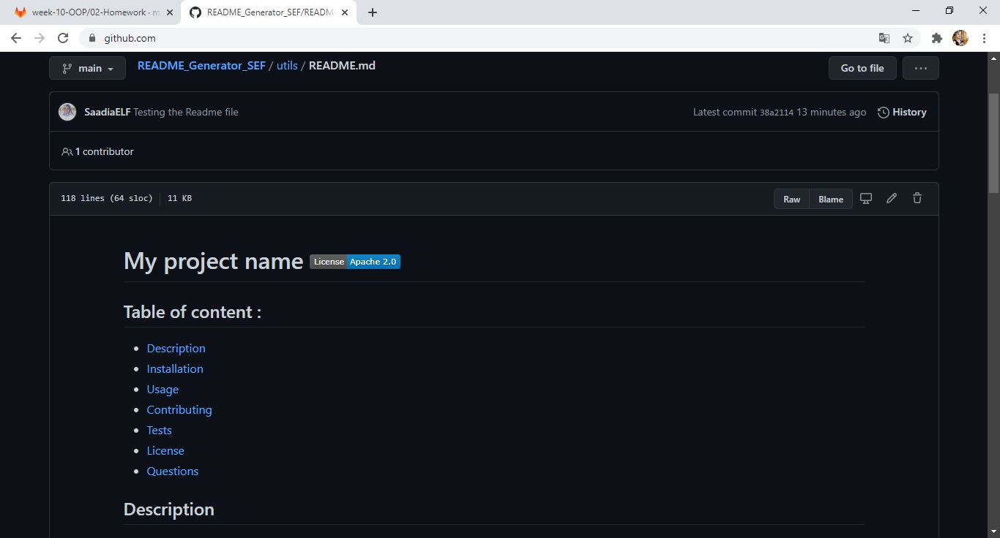
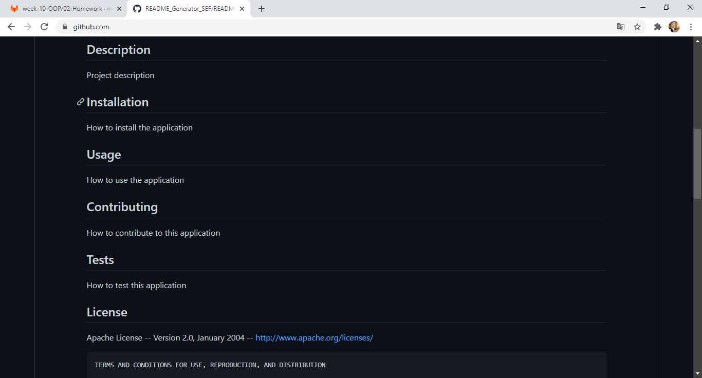
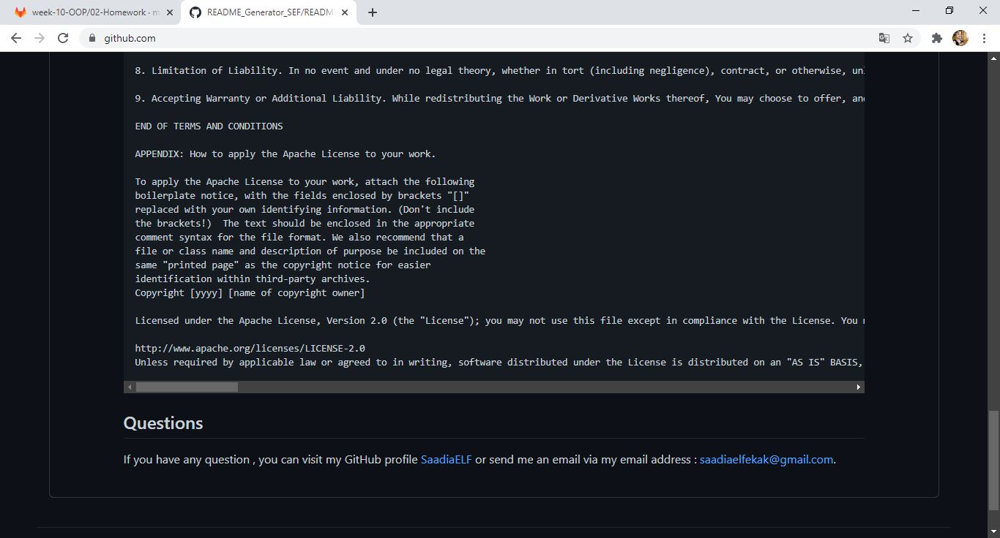

# README_Generator_SEF 
-----------------------------------------------------------------------------------------------------------------------
Table of content :

* [Purpose](#Purpose)
* [Method](#Method)
* [Node.js](#Nodejs)
* [JavaScript](#JavaScript) 
* [Demonstration](#Demonstration)
* [URLs](#URLs) 

-----------------------------------------------------------------------------------------------------------------------

## Purpose

The main purpose of this project is create a command-line application that dynamically generates a professional README.md file from a user's input using the Inquirer package. 

-----------------------------------------------------------------------------------------------------------------------

## Method

This application is created using the following languages, libraries and software.

    * Node.js
    * Javascript files : index.js, generateMarkdown.js
    * VS Code
    * Github
   
-----------------------------------------------------------------------------------------------------------------------

## Nodejs
    
This open-source back-end JavaScript runtime environment is used to invoke the README file using the following commands :

    * node init -y : to intialise node
    * node i inquirer : to install the inquirer package
    * node index.js : to invoke the application (starts a serie of prompts)
-----------------------------------------------------------------------------------------------------------------------

## JavaScript 

This programming language is used to create two files :

* index.js : holds the application 
* generateMarkdown : holds functions that generate the Markdown of the README file

-----------------------------------------------------------------------------------------------------------------------

## Demonstration

Screenshots :

Walkthrough videos:
*Demo01 :* (https://drive.google.com/file/d/12nmbFQyjz-jR03E3_iOzyT45Yq0VGPA9/view?usp=sharing)
*Demo02 :* (https://drive.google.com/file/d/1MeVyI3GHC-hBHv9WKGWLhESarI6jdp1Y/view?usp=sharing)
-----------------------------------------------------------------------------------------------------------------------

## URLs

The URL of the GitHub repository: https://github.com/SaadiaELF/README_Generator_SEF.git

-----------------------------------------------------------------------------------------------------------------------
